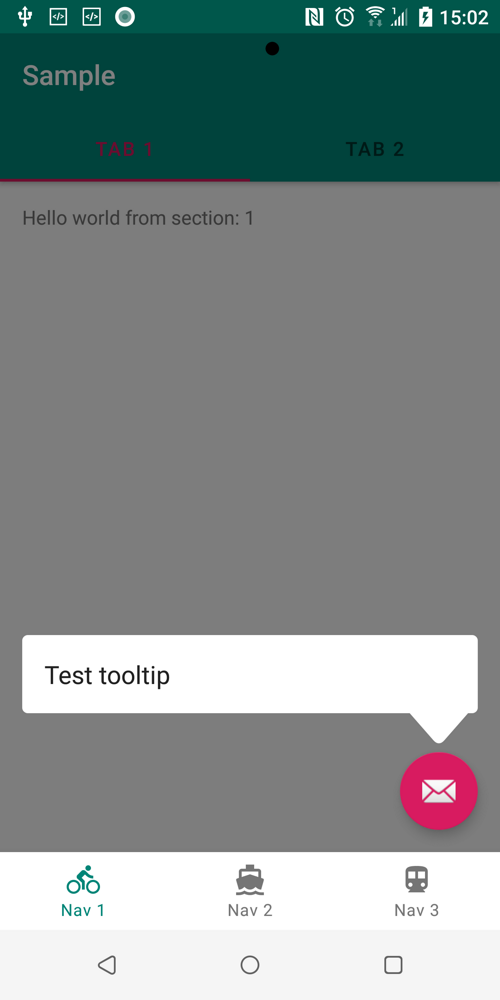

# OnboardingTooltips

Example usage (see module `sample`)

```java
val tooltipView = TooltipView(this, "Test tooltip")
val density = resources.displayMetrics.density
tooltipView.setPadding((density * 16).toInt(), (density * 4).toInt(), (density * 16).toInt(), (density * 4).toInt())

fab.doOnPreDraw {
    TooltipOverlayPopup().show(
        TooltipOverlayParams(tooltipView, fab)
            .setDismissOnTouchAnchor(false)
            .setAnchorClickable(false)
            .setDismissOnTouchOutside(false)
            .withTooltipPosition(TooltipPosition.TOP)
            .withBottomBarrier(findViewById(R.id.bottom_nav)),
        this
    )
}
```



You also can show your own widgets as tooltips or implement `AnchoredTooltip`.
By default, you can use `TooltipView` which shows simple text or any TextView passed through constructor.